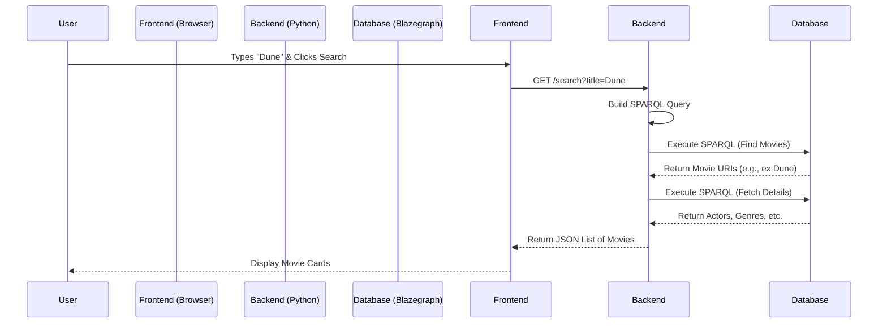

# Application Architecture Description

This document describes how the Movie Explorer web application works. It is designed to help someone with minimal web development experience understand the structure and functionality of the code.

## Overview

The application is a "Semantic Web" movie explorer. Unlike traditional apps that store data in tables (like Excel), this app stores data as a "graph" of connections (RDF format), which allows for flexible querying of relationships (e.g., "Find movies that share the same actors and genre").

The app consists of three main parts:
1.  **Data Pipeline (Root Scripts):** A set of Python scripts that collect, clean, and convert raw movie data into the graph format (`.ttl`).
2.  **Backend (Python/FastAPI):** A server that connects to the **Blazegraph** graph database to answer questions (queries) from the frontend.
3.  **Frontend (Next.js/React):** The website you see in your browser. It allows you to select filters and displays the movie results.

---

## Example Workflow: Searching for "Dune"

Here is exactly what happens, step-by-step, when you search for "Dune":



### 1. User Interaction (Frontend)
*   **File:** [`frontend/components/Sidebar.tsx`](frontend/components/Sidebar.tsx)
*   **Action:** You type "Dune" into the input box. The React state updates via [`handleChange`](frontend/components/Sidebar.tsx#L14-L16). When you click "Search", it triggers the `onSearch` event.
*   **File:** [`frontend/app/page.tsx`](frontend/app/page.tsx)
*   **Action:** The [`handleSearch`](frontend/app/page.tsx#L30-L41) function is called. It sets `loading` to `true` (showing the spinner) and calls the API function.

### 2. Sending the Request (Frontend -> Backend)
*   **File:** [`frontend/lib/api.ts`](frontend/lib/api.ts)
*   **Action:** The [`searchMovies({ title: "Dune" })`](frontend/lib/api.ts#L15-L25) function sends an HTTP GET request to the backend:
    `http://localhost:8000/search?title=Dune`

### 3. Processing the Request (Backend)
*   **File:** [`backend/main.py`](backend/main.py)
*   **Action:** The server receives the request at the [`/search`](backend/main.py#L91-L110) endpoint. It extracts `title="Dune"` and passes it to the `engine`.
    ```python
    # main.py
    results = engine.search_movies(title="Dune", ...)
    ```

### 4. Querying the Graph (Backend -> Database)
*   **File:** [`backend/query_engine.py`](backend/query_engine.py)
*   **Action:** The [`search_movies`](backend/query_engine.py#L111-L211) method converts your "Dune" search into a **SPARQL Query** (the language of graph databases).
    *   **Query 1 (Find Matches):** "Find all movies where the title contains 'Dune' (case-insensitive)."
    *   **Execution:** It sends this query to **Blazegraph** running on port 8080.
    *   **Result:** Blazegraph returns the IDs (URIs) of matching movies, e.g., `<http://example.org/movie/Dune>` and `<http://example.org/movie/Dune_Part_Two>`.

### 5. Fetching Details (Backend -> Database)
*   **File:** [`backend/query_engine.py`](backend/query_engine.py)
*   **Action:** Now that the backend knows *which* movies matched, it needs their details (Actors, Genres, Directors). It runs a **second SPARQL query** specifically for those movie IDs to get that info.
*   **Reason:** This is often faster than doing one giant complex query.

### 6. Sending Response (Backend -> Frontend)
*   **File:** [`backend/main.py`](backend/main.py)
*   **Action:** The `engine` bundles all this data into a nice list of dictionaries (JSON format) and sends it back to the browser.
    ```json
    [
      { "title": "Dune", "year": "2021", "genres": ["Science Fiction"], ... },
      { "title": "Dune: Part Two", "year": "2024", ... }
    ]
    ```

### 7. Displaying Results (Frontend)
*   **File:** [`frontend/app/page.tsx`](frontend/app/page.tsx)
*   **Action:** The `handleSearch` function receives the data. It updates the `movies` state variable.
*   **File:** [`frontend/components/MovieCard.tsx`](frontend/components/MovieCard.tsx)
*   **Action:** React sees the new data and draws a [`MovieCard`](frontend/components/MovieCard.tsx#L10-L70) component for each movie in the list, showing the poster, title, and actors.

---

## File Descriptions

### 1. Data Pipeline (Root Directory)
These scripts are responsible for creating the database used by the app.

*   [`csv_to_rdf.py`](csv_to_rdf.py): Converts cleaned spreadsheet data (CSV) into the final graph database format (Turtle/RDF).
*   [`data_preprocessing.py`](data_preprocessing.py): Cleans raw data, fixes errors (like converting minutes to hours), and merges data from different sources.
*   [`merge_csv_files.py`](merge_csv_files.py): Combines multiple small data files into one large file.
*   [`wikidata_to_dbpedia_movies.py`](wikidata_to_dbpedia_movies.py): Connects to online databases (Wikidata and DBpedia) to get more details about movies.
*   [`run_sparql.py`](run_sparql.py): A testing script to run example queries against the database.
*   [`debug_sparql.py`](debug_sparql.py): A simple script to help fix issues with queries.

### 2. Backend (`backend/`)
The "brain" of the application that processes search requests.

*   [`main.py`](backend/main.py): The entry point of the server. It receives requests from the internet.
*   [`query_engine.py`](backend/query_engine.py): The logic for searching the graph database.
*   [`vocab.py`](backend/vocab.py): Defines the specific "language" (vocabulary) used to label data in the graph.

### 3. Frontend (`frontend/`)
The visual interface of the application.

*   [`app/page.tsx`](frontend/app/page.tsx): The main homepage file. It coordinates the sidebar and the movie list.
*   [`app/layout.tsx`](frontend/app/layout.tsx): Defines the global structure (fonts, themes) shared by all pages.
*   [`components/Sidebar.tsx`](frontend/components/Sidebar.tsx): The left panel with search filters (Title, Genre, etc.).
*   [`components/MovieCard.tsx`](frontend/components/MovieCard.tsx): A component that displays a single movie's poster and details.
*   [`lib/api.ts`](frontend/lib/api.ts): A helper file that handles communication with the Backend.

---

## Detailed Function Breakdown

### 1. Data Pipeline Scripts

#### `csv_to_rdf.py`
*   `to_uri(text)`: Takes a simple text string (e.g., "Star Wars") and converts it into a unique web identifier (URI) usable in the graph database (e.g., `http://example.org/movie/Star_Wars`).
*   **Main Logic**: Reads the CSV file row by row. For each movie, it creates "statements" (triples) like "Movie X has title Y" or "Movie X has director Z" and saves them to a `.ttl` file.

#### `data_preprocessing.py`
*   **Main Logic**:
    *   Loads raw data.
    *   Removes unnecessary columns (like internal IDs).
    *   Converts runtimes from minutes to hours for consistency.
    *   Fills in missing information using data fetched from DBpedia (a structured version of Wikipedia).
    *   Saves the cleaned data.

#### `wikidata_to_dbpedia_movies.py`
*   `run_sparql(endpoint, query)`: A helper function that sends a query to an external database (Wikidata or DBpedia) and returns the results.
*   `get_dbpedia_uris(qids)`: Takes a list of Wikidata IDs and finds their corresponding pages on DBpedia.
*   `get_movie_data(dbpedia_uris)`: Asks DBpedia for specific details (Director, Actors, Runtime) for a list of movies.
*   **Main Logic**: Orchestrates the fetching of external data to enrich the local dataset.

#### `run_sparql.py`
*   `test_query(query)`: Runs a specific SPARQL query against the local graph and prints the results.
*   **Queries**: Contains several pre-written queries (strings) to test features like "Movies sharing actors", "Movies by a specific director", etc.

### 2. Backend Files

#### `backend/main.py`
*   `read_root()`: A simple health check. If you visit the root URL, it says "Movie Explorer API is running".
*   `get_filter_options()`: Called by the frontend to get the list of all available Genres, Actors, and Directors to populate the dropdown menus.
*   `search_movies(...)`: The main search endpoint. It accepts parameters (title, genre, actor, etc.) from the frontend and passes them to the `QueryEngine`.

#### `backend/query_engine.py`
*   `__init__`: Connects to the **Blazegraph** SPARQL endpoint. It also includes logic to automatically upload the `.ttl` file to the database on startup if it's empty.
*   `get_options()`:
    *   Runs three separate queries to find every unique genre, director, and the most popular actors in the database.
    *   Returns these lists to the frontend.
*   `search_movies(...)`:
    *   **Step 1**: Builds a dynamic query based on what the user searched for. It finds the matching movies and gets their basic info (ID, Title, Year). It uses a `LIMIT` to keep things fast.
    *   **Step 2**: For the movies found in Step 1, it runs a second query to fetch all their details (Actors, Directors, Genres). This is done in two steps to be much faster than trying to do it all at once.

### 3. Frontend Files

#### `frontend/lib/api.ts`
*   `getOptions()`: Sends a request to the backend's `/options` endpoint.
*   `searchMovies(params)`: Sends a request to the backend's `/search` endpoint with the user's selected filters.

#### `frontend/app/page.tsx`
*   `useEffect`: Runs once when the page loads to fetch the initial options (genres, actors) for the sidebar.
*   `handleSearch`: Called when the user clicks "Search". It asks `api.ts` to get data, sets the `loading` state (to show a spinner), and then updates the `movies` list with the results.
*   **Render**: Displays the `Sidebar` on the left and a grid of `MovieCard` components on the right.

#### `frontend/components/Sidebar.tsx`
*   `handleChange`: Updates the local state whenever a user types in a box or selects an option.
*   **Render**: Draws the search inputs, dropdowns, and the big "Search" button.

#### `frontend/components/MovieCard.tsx`
*   **Render**: Displays a nice card for a movie. It uses `framer-motion` to fade in the card when it appears. It shows the title, year, runtime, and lists of actors/directors.
